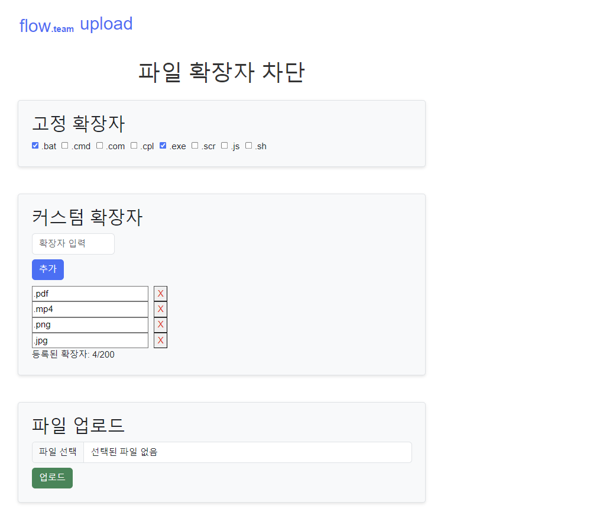

# Flow

### 마드라스체크 과제: 확장자 차단 기능 구현

## 시스템 환경

- **Backend**: Node.js, Express.js
- **Database**: MySQL
- **파일 암호화**: Crypto 모듈 (AES-256-CTR 알고리즘)
- **로그 관리**: Winston

## 프로젝트 구현 과정에서의 고민과 해결

이 프로젝트를 수행하면서 고객의 관점에서 고려한 고민 사항과 그 해결 과정을 정리한 내용입니다.

1. **파일 암호화 처리**
   - 민감한 데이터가 포함될 수 있는 파일을 서버에 그대로 저장하는 것은 보안상의 위험이 크다고 판단했습니다. 이에 따라 `AES-256-CTR` 알고리즘을 선택하여 파일을 암호화했습니다.
   - 암호화된 파일을 저장하기 전에, 파일의 무결성을 유지하기 위해 오류가 발생한 경우 파일을 안전하게 삭제하는 기능을 추가했습니다.

2. **확장자 차단 로직 구현**
   - 단순히 파일 확장자만 확인하는 것은 확장자 차단에 있어서 한계가 있다고 생각했습니다. 확장자를 변경하여 우회하는 것을 방지하기 위해, 파일의 확장자와 MIME 타입을 동시에 검사하는 로직을 구현했습니다.
   - 업로드된 파일의 실제 내용을 기반으로 MIME 타입을 추출하고, 사용자가 지정한 확장자와 일치하지 않는 경우 파일 업로드를 차단했습니다.

3. **로그 관리**
   - 시스템 내에서 발생하는 에러와 이벤트를 효과적으로 관리하고 분석하기 위해 `winston` 라이브러리를 사용하여 로그 시스템을 구축했습니다.
   - 로그를 `info`, `warn`, `error`와 같은 레벨로 구분하여 기록하며, 시스템 에러와 관련된 로그는 별도로 파일로 저장하도록 설정했습니다.

4. **파일 처리 및 보안**
   - 파일 업로드 시, 불필요한 데이터를 제거하고 파일이 안전하게 처리될 수 있도록 `secureDelete` 함수를 구현했습니다. 이 함수는 파일을 덮어쓰고 삭제하여 데이터를 완전히 제거합니다.

## 파일 확장자 차단

- **고정 확장자**: 자주 차단되는 확장자들을 리스트 형태로 제공하며, default 값은 `unCheck`로 설정했습니다.
- **상태 유지**: 고정 확장자를 체크하거나 해제하면 해당 상태가 DB(MySQL)에 저장되어 새로고침 후에도 유지됩니다.

## 1. 고정 확장자 관리
- **고정확장자 리스트**: 자주 차단되는 확장자들은 리스트 형태로 제공되며, 기본값은 `unCheck`로 설정되었습니다.
- **상태 유지**: 고정 확장자를 체크하거나 체크 해제할 경우, 해당 상태가 DB(MySQL)에 저장되어 새로고침 후에도 유지됩니다.

## 2. 커스텀 확장자 관리
- **확장자 입력 제한**: 커스텀 확장자는 최대 20자리까지 입력할 수 있습니다.
- **중복 방지**: 이미 등록된 확장자는 중복으로 등록되지 않도록 방지했습니다.
- **최대 개수 제한**: 커스텀 확장자는 최대 200개까지 추가할 수 있습니다.
- **확장자 삭제**: 등록된 커스텀 확장자는 목록에서 삭제할 수 있으며, 삭제 시 즉시 DB에 반영됩니다.

## 3. 파일 업로드
- **차단된 확장자 파일**: 차단된 확장자 파일은 업로드가 제한됩니다.
- **파일 암호화**: 정보 유출 방지 목적으로 업로드된 파일은 서버에 저장되기 전에 `AES-256-CTR` 알고리즘을 사용하여 암호화됩니다.
- **MIME 타입 검증**: 파일 업로드 시, 클라이언트에서 전송된 확장자와 서버에서 검증한 실제 MIME 타입이 일치하는지 확인하여, 일치하면 저장하고, 일치하지 않으면 저장을 차단합니다.

##

fixed_extensions(고정 확장자):

차단할 파일 확장자의 문자열을 저장. 이 확장자는 default가 unCheck 상태여야하므로 boolean 타입으로 기본값 False 부여. 

custom_extensions(커스텀 확장자):

확장자가 언제 추가되었는지를 기록하기 위해 created_at 필드를 TIMESTAMP로 설정.

## 설치 및 실행 방법

1. git clone:
    
    bash

    git clone https://github.com/yourusername/yourprojectname.git

    cd yourprojectname
    

2. npm 설치:
    
    bash
    
    npm install
    

3. 환경 변수 파일 설정

    '.env' 파일 설정
    
    .env:

      DB_HOST=your_database_host

      DB_USER=your_database_user

      DB_PASSWORD=your_database_password

      DB_NAME=your_database_name

      ENCRYPTION_KEY=your_encryption_key

      PORT=your_server_port
      

4. 서버 실행
    
    bash
    
    npm start
    

5. 브라우저에서 'http://localhost:PORT' 로 접속